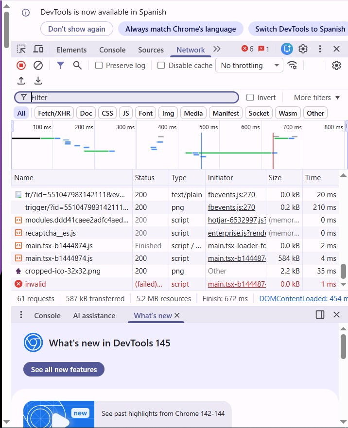
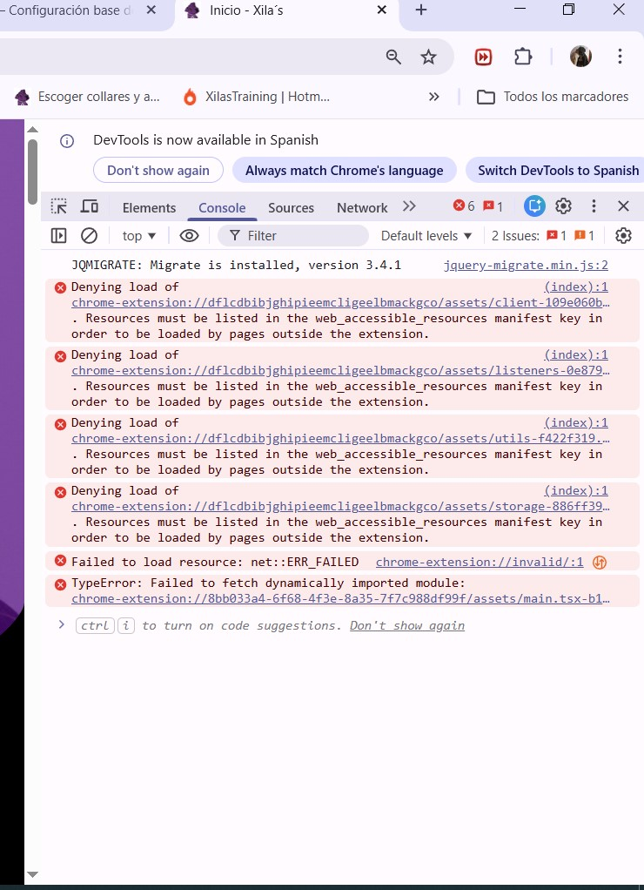

# Issue 1.3 – Diferencia entre Editor e IDE

## ¿Qué es un editor de código?

Un editor de código es una herramienta que permite escribir y editar código fuente.
Su función principal es facilitar la escritura de programas mediante resaltado de sintaxis,
autocompletado y gestión básica de archivos.

Un editor por sí mismo no incluye todas las herramientas necesarias para desarrollar software
completo, como compiladores, depuradores o gestores de dependencias.

## ¿Qué es un IDE?

Un IDE (Integrated Development Environment) es un entorno de desarrollo completo que integra
varias herramientas necesarias para programar en una sola aplicación.

Un IDE normalmente incluye:

- Editor de código
- Compilador o intérprete
- Depurador (debugger)
- Gestión de dependencias
- Integración con control de versiones
- Herramientas de análisis de código

Ejemplos de IDE conocidos incluyen IntelliJ IDEA, Eclipse o Visual Studio.

## ¿Por qué VS Code puede funcionar como IDE?

Visual Studio Code es originalmente un editor de código, pero gracias a su sistema de
extensiones puede ampliarse para incluir muchas funcionalidades de un IDE.

Por ejemplo, en este proyecto se han instalado herramientas como:

- ESLint para análisis de código
- Prettier para formateo automático
- Node.js y npm para gestión del proyecto

Gracias a estas extensiones y herramientas, Visual Studio Code puede proporcionar un
entorno de desarrollo completo similar al de un IDE.

## Conclusión

Aunque Visual Studio Code es técnicamente un editor de código, su arquitectura basada
en extensiones permite transformarlo en un entorno de desarrollo completo adaptado
a diferentes lenguajes y necesidades del desarrollador.

Para analizar el rendimiento de la página se utilizó la pestaña **Network** de las herramientas de desarrollo del navegador.

Se recargó la página y se analizaron las peticiones realizadas por el navegador, observando el tipo de recurso, tamaño y tiempo de carga de cada uno.

El análisis permitió identificar algunos posibles problemas de rendimiento.

### Problemas detectados

1. **Archivo JavaScript de gran tamaño**
   - Recurso: `main.tsx-b1444874.js`
   - Tipo: script
   - Tamaño: 584 KB

   **Problema:**  
   Un archivo JavaScript grande puede ralentizar la carga de la página.

   **Solución propuesta:**  
   Minificar el código o dividir el archivo en varios bundles (code splitting).

---

2. **Recurso que falla al cargarse**
   - Recurso: `invalid`
   - Estado: failed
   - Tipo: script

   **Problema:**  
   El navegador intenta cargar un script que no existe o cuya ruta es incorrecta.

   **Solución propuesta:**  
   Revisar la ruta del archivo o verificar que el recurso exista en el servidor.

---

3. **Número elevado de peticiones**
   - Total de peticiones: 61

   **Problema:**  
    Un número alto de peticiones puede aumentar el tiempo total de carga.

   **Solución propuesta:**  
    Combinar archivos, usar caché o utilizar una CDN.

   ### Captura del análisis de Network

   
   

## Issue 2.2 – Depuración con Console

Para analizar errores de ejecución se utilizó la pestaña Console de las herramientas de desarrollo del navegador.

Durante el análisis se detectaron varios errores generados por scripts y extensiones del navegador.

### Error detectado

Tipo de error: Failed to fetch dynamically imported module

Descripción:
El navegador intenta cargar un módulo JavaScript dinámicamente pero no puede encontrar el recurso.

Impacto:
Este error puede impedir que algunas funcionalidades de la página se ejecuten correctamente.

Solución propuesta:
Verificar la ruta del archivo JavaScript y asegurar que el módulo esté disponible en el servidor.

### Otros errores observados

También se detectaron errores relacionados con extensiones del navegador que intentaban cargar recursos bloqueados por Chrome.

### Captura de la consola

### Identificación del concepto

Un error conceptual común cuando se empieza en desarrollo de software es pensar que un editor de código es automáticamente un IDE (Integrated Development Environment).

Un editor de código es una herramienta diseñada principalmente para escribir y editar archivos de programación. En cambio, un IDE es un entorno más completo que integra múltiples herramientas necesarias para el desarrollo de software, como depuradores, compiladores, sistemas de construcción y gestión de dependencias.

Muchos desarrolladores principiantes creen que herramientas como Visual Studio Code son IDEs por defecto, cuando en realidad son editores de código que pueden ampliarse mediante extensiones para ofrecer funcionalidades similares a un IDE.

### Qué es un editor de código

Un editor de código es una herramienta utilizada para escribir y editar archivos de programación. Su función principal es facilitar la lectura y escritura de código mediante características como resaltado de sintaxis, autocompletado y navegación entre archivos.

A diferencia de un entorno de desarrollo integrado (IDE), un editor de código no incluye necesariamente herramientas avanzadas de desarrollo como compiladores, depuradores o gestores de proyectos.

Un ejemplo de editor de código es Visual Studio Code, que permite trabajar con múltiples lenguajes de programación y puede ampliarse mediante extensiones para añadir nuevas funcionalidades.

### Qué es un IDE

Un IDE (Integrated Development Environment) es un entorno de desarrollo que integra múltiples herramientas necesarias para crear software en una sola aplicación.

A diferencia de un editor de código, un IDE incluye funcionalidades más avanzadas como compiladores, depuradores, herramientas de testing, gestión de dependencias y sistemas de construcción del proyecto.

Esto permite a los desarrolladores escribir, ejecutar, probar y depurar código desde un mismo entorno, lo que facilita el desarrollo de aplicaciones más complejas.

Algunos ejemplos de IDE son IntelliJ IDEA, Eclipse o Visual Studio.

### Por qué Visual Studio Code puede funcionar como un IDE

Visual Studio Code es originalmente un editor de código ligero. Sin embargo, gracias a su sistema de extensiones puede ampliarse para incorporar muchas de las herramientas que normalmente forman parte de un IDE.

Mediante extensiones es posible añadir funcionalidades como análisis de código, formateo automático, depuración, control de versiones o gestión de dependencias.

En este proyecto se han configurado herramientas como ESLint para el análisis de código y Prettier para el formateo automático. Además, se utiliza npm para gestionar dependencias y la terminal integrada del editor para ejecutar comandos.

Gracias a estas herramientas, Visual Studio Code puede ofrecer una experiencia de desarrollo muy similar a la de un entorno de desarrollo integrado (IDE).
